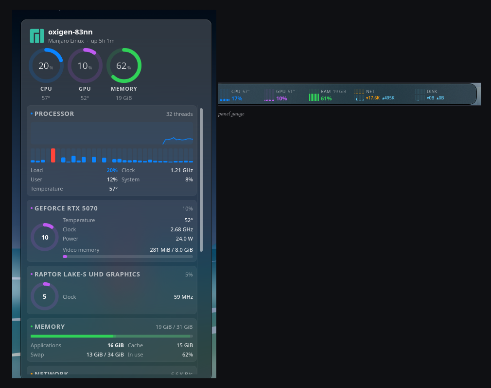
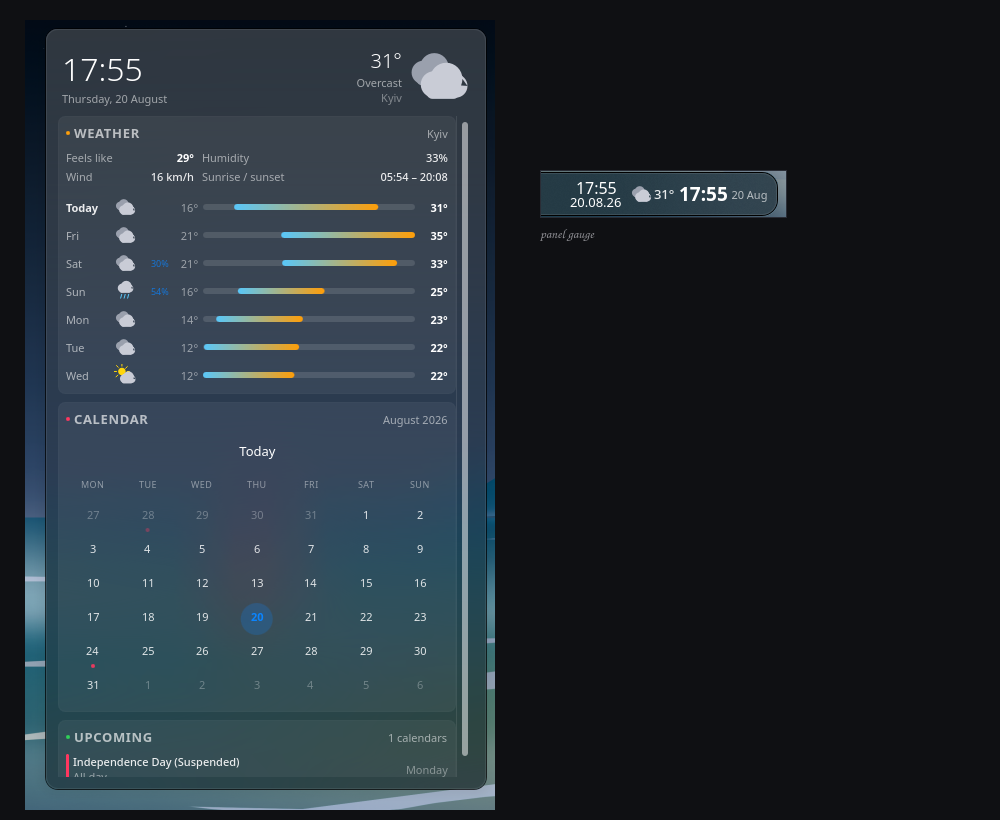

# Plasma widgets

Panel widgets for Plasma 6, built on KDE's own data sources — no polling
scripts, no background daemons of their own.

| Widget | What it does |
|---|---|
| [Corestrip](widgets/corestrip/) | CPU, GPU, memory, network and disk load, with a detail popup |
| [Daystrip](widgets/daystrip/) | Clock, date and weather, with a calendar, forecast and agenda popup |





## Install

```sh
./install.sh                # every widget
./install.sh daystrip       # just one
```

Then add it: right-click the panel → *Add or Manage Widgets…*

To remove: `./uninstall.sh daystrip`.

## Build a bundle

```sh
./package.sh                # dist/<widget>-<version>.plasmoid
./package.sh daystrip
```

A `.plasmoid` bundle is what store.kde.org and Plasma's *Get New Widgets*
accept. Pushing a `v*` tag builds every bundle in CI and attaches them to the
GitHub release.

Each widget keeps its own README, changelog, screenshots and packaging under
`widgets/<name>/`.

## License

MIT — see [LICENSE](LICENSE).
